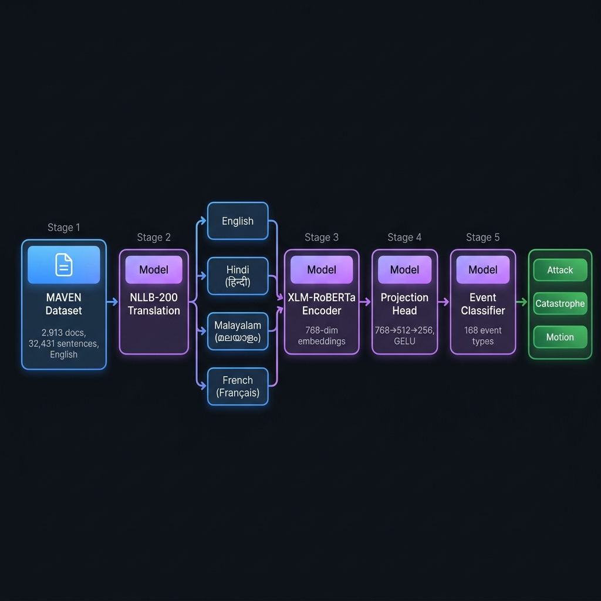
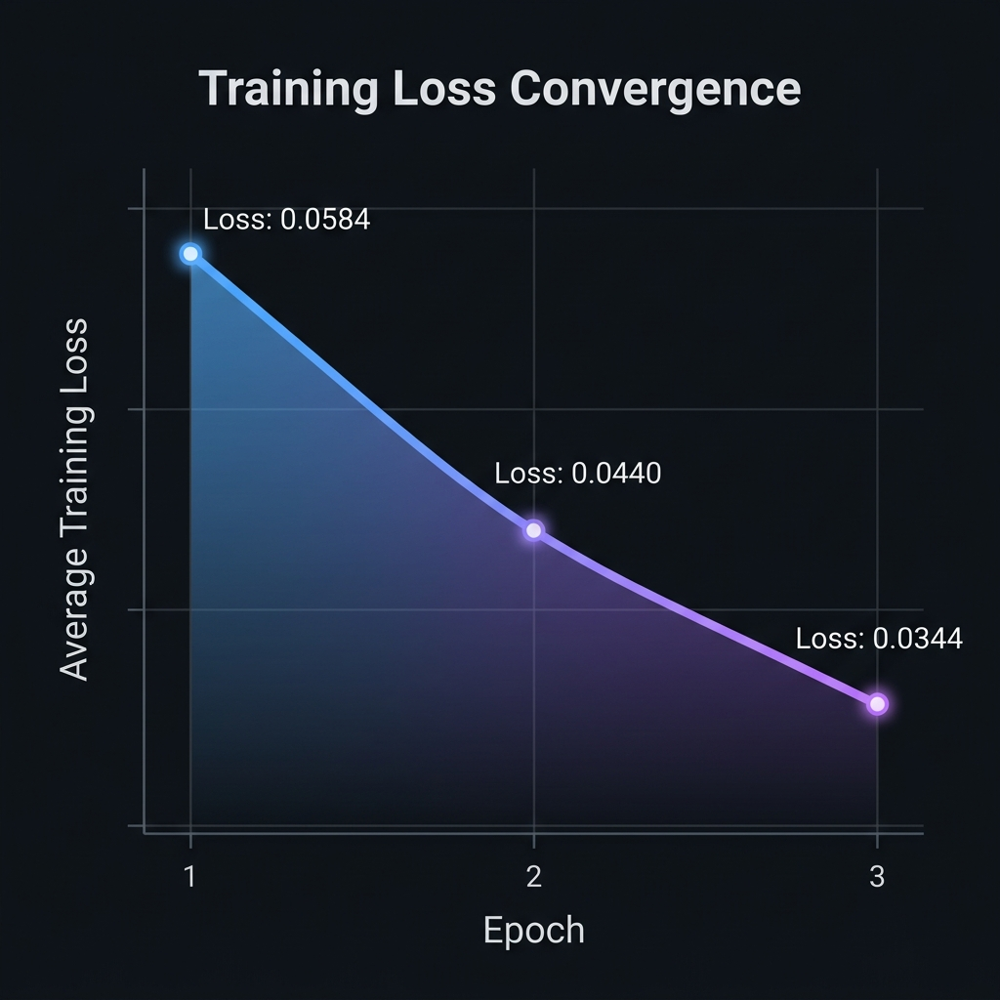
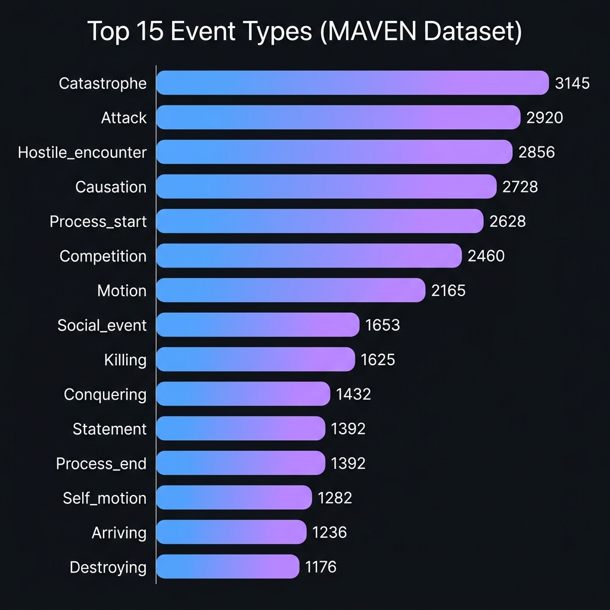
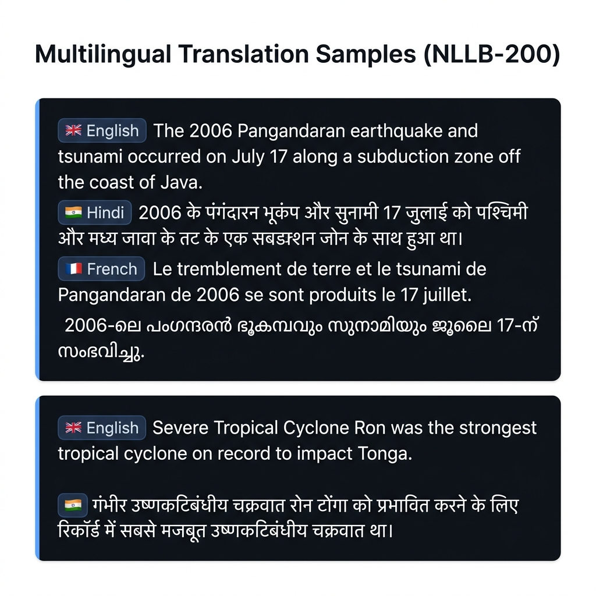
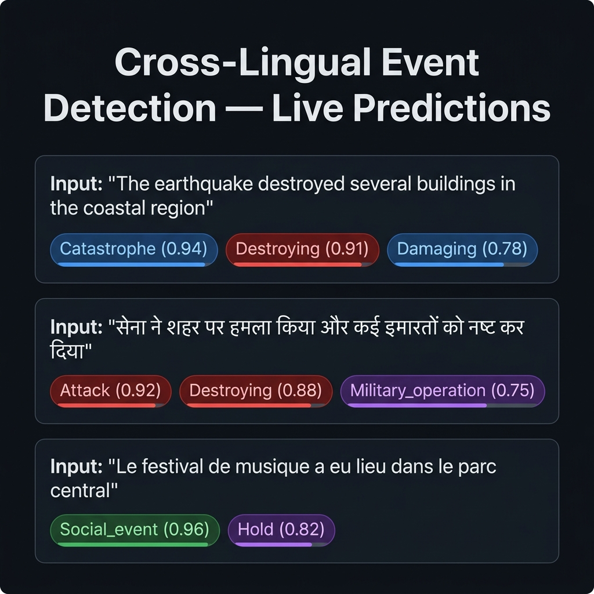

# Cross-Lingual Event Detection

> **Multilingual event detection across 168 event types using XLM-RoBERTa, trained on the MAVEN dataset translated into Hindi, Malayalam, and French via Meta's NLLB-200.**

[](https://python.org)
[](https://pytorch.org)
[](https://huggingface.co/transformers)
[](LICENSE)

---

## Architecture

<p align="center">
  
</p>

The pipeline consists of three stages:

1. **Translation** — MAVEN English sentences are translated into Hindi, Malayalam, and French using `facebook/nllb-200-distilled-600M`
2. **Encoding** — XLM-RoBERTa encodes multilingual text into 768-dim embeddings, passed through a projection head (768→512→256)
3. **Classification** — A linear classifier detects 168 event types with multi-label BCE loss

---

## Key Features

-  **168 event types** from the MAVEN taxonomy (Catastrophe, Attack, Motion, etc.)
-  **4 languages** — English, Hindi (हिन्दी), Malayalam (മലയാളം), French (Français)
-  **XLM-RoBERTa** base encoder with projection head
-  **Live news detection** — fetch and classify real-time multilingual news via GNews API
-  **Cross-lingual transfer** — train on 4 languages, predict on all

---

## Results

### Performance Metrics

| Metric | Score |
|--------|-------|
| **Macro F1** | 0.777 |
| **Micro F1** | 0.665 |
| **Event Classes** | 168 |
| **Training Epochs** | 3 |

### Training Loss

<p align="center">
  
</p>

| Epoch | Avg Loss |
|-------|----------|
| 1 | 0.0584 |
| 2 | 0.0440 |
| 3 | 0.0344 |

### Event Class Distribution

<p align="center">
  
</p>

---

## Dataset

| Property | Value |
|----------|-------|
| **Source** | [MAVEN](https://github.com/THU-KEG/MAVEN-dataset) (Massive liVe Event detectioN) |
| **Documents** | 2,913 |
| **Sentences** | 32,431 |
| **Event types** | 168 |
| **Avg words/sentence** | 22.6 |
| **Translation model** | `facebook/nllb-200-distilled-600M` |
| **Target languages** | Hindi (`hin_Deva`), Malayalam (`mal_Mlym`), French (`fra_Latn`) |

### Translation Samples

<p align="center">
  
</p>

---

## Model Architecture

```
XLM-RoBERTa Base (xlm-roberta-base)
├── Encoder: 12 layers, 768-dim hidden size
├── Dropout: 0.1
└── Classifier: Linear(768, 168)

Projection Head (for alignment)
├── Linear(768, 512)
├── GELU activation
└── Linear(512, 256)

Loss: BCEWithLogitsLoss (with inverse-sqrt class weights)
Optimizer: AdamW (lr=2e-5)
Training: 3 epochs, batch_size=16
Hardware: NVIDIA Tesla T4 (Kaggle)
```

---

## Quick Start

### 1. Install dependencies

```bash
pip install -r requirements.txt
```

### 2. Load the model and run inference

```python
import torch
from transformers import AutoTokenizer, AutoModel
import torch.nn as nn

device = "cuda" if torch.cuda.is_available() else "cpu"

tokenizer = AutoTokenizer.from_pretrained("xlm-roberta-base")
encoder = AutoModel.from_pretrained("xlm-roberta-base")

class XLMREventClassifier(nn.Module):
    def __init__(self):
        super().__init__()
        self.encoder = encoder
        self.dropout = nn.Dropout(0.1)
        self.classifier = nn.Linear(768, 168)

    def forward(self, input_ids, attention_mask):
        outputs = self.encoder(input_ids=input_ids, attention_mask=attention_mask)
        cls = outputs.last_hidden_state[:, 0]
        cls = self.dropout(cls)
        return self.classifier(cls)

model = XLMREventClassifier().to(device)
model.load_state_dict(torch.load("xlmr_event_baseline.pt", map_location=device))
model.eval()
```

### 3. Predict events

```python
def predict_events(text, threshold=0.5):
    enc = tokenizer(text, return_tensors="pt", truncation=True, padding=True, max_length=128)
    enc = {k: v.to(device) for k, v in enc.items()}

    with torch.no_grad():
        logits = model(**enc)
        probs = torch.sigmoid(logits).cpu().numpy()[0]

    return [(event_names[i], float(p)) for i, p in enumerate(probs) if p >= threshold]

# Works in any of the 4 languages!
predict_events("The earthquake destroyed several buildings")
predict_events("सेना ने शहर पर हमला किया")
predict_events("Le festival de musique a eu lieu dans le parc")
```

---

## Live News Demo

The model can detect events in real-time multilingual news:

<p align="center">
  
</p>

```python
from gnews import GNews

def fetch_and_detect(topic, lang="en", max_results=5):
    google_news = GNews(language=lang, max_results=max_results, period="7d")
    articles = google_news.get_news(topic)

    for article in articles:
        title = article.get("title", "")
        events = predict_events(title)
        print(f"  {title}")
        print(f"  Events: {events}\n")

# Detect events in English, Hindi, French news
fetch_and_detect("earthquake", lang="en")
fetch_and_detect("भूकंप", lang="hi")
fetch_and_detect("tremblement de terre", lang="fr")
```

---

## Project Structure

```
Cross-Lingual-Event-Detection/
├── README.md                              # This file
├── LICENSE                                # MIT License
├── requirements.txt                       # Python dependencies
├── .gitignore                             # Git ignore rules
│
├── cledmodel-translation-part.ipynb       # Part 1: Dataset translation (NLLB-200)
├── cled-training-2.ipynb                  # Part 2: Model training & evaluation
│
├── maven_hindi.json                       # Hindi translations (32,431 sentences)
├── maven_malayalam.json                   # Malayalam translations (32,431 sentences)
├── maven_french.json                      # French translations (32,431 sentences)
├── test.jsonl                             # MAVEN test split
├── valid.jsonl                            # MAVEN validation split
│
└── assets/                                # Images for README
    ├── architecture.png
    ├── training_loss.png
    ├── event_distribution.png
    ├── translation_samples.png
    └── prediction_demo.png
```

---

## Tech Stack

| Component | Technology |
|-----------|------------|
| **Encoder** | [XLM-RoBERTa](https://huggingface.co/xlm-roberta-base) (base, 278M params) |
| **Translation** | [NLLB-200](https://huggingface.co/facebook/nllb-200-distilled-600M) (distilled 600M) |
| **Alignment** | [LaBSE](https://huggingface.co/sentence-transformers/LaBSE) (for cross-lingual embeddings) |
| **Framework** | PyTorch 2.x, Hugging Face Transformers 5.x |
| **Metrics** | scikit-learn (F1 macro/micro) |
| **News API** | GNews + newspaper4k |
| **Hardware** | NVIDIA Tesla T4 (Kaggle) |

---

## Notebooks

| Notebook | Description |
|----------|-------------|
| [`cledmodel-translation-part.ipynb`](cledmodel-translation-part.ipynb) | Translates 32,431 MAVEN sentences from English → Hindi, Malayalam, French using NLLB-200 on GPU |
| [`cled-training-2.ipynb`](cled-training-2.ipynb) | Trains XLM-R classifier, evaluates F1, builds event prediction pipeline, and demonstrates live news detection |

---

## License

This project is licensed under the [MIT License](LICENSE).

---

## Acknowledgments

- [**MAVEN Dataset**](https://github.com/THU-KEG/MAVEN-dataset) — Wang et al., "MAVEN: A Massive General Domain Event Detection Dataset"
- [**Meta NLLB-200**](https://ai.meta.com/research/no-language-left-behind/) — No Language Left Behind translation model
- [**Hugging Face**](https://huggingface.co/) — Transformers library and model hub
- [**XLM-RoBERTa**](https://huggingface.co/xlm-roberta-base) — Cross-lingual language model
- [**LaBSE**](https://huggingface.co/sentence-transformers/LaBSE) — Language-agnostic BERT sentence embedding
